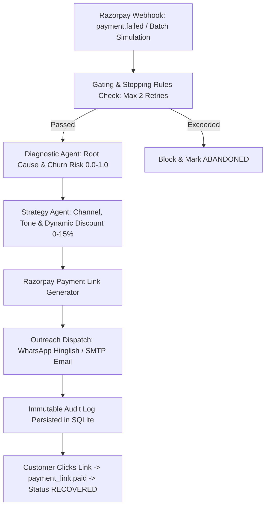

# 🦈 AI Revenue Recovery Agent (Razorpay Buildathon)

> **Autonomous, bounded multi-agent system that detects revenue at risk (failed payments, abandoned checkouts), determines personalized interventions with dynamic discounts, and executes recovery workflows via WhatsApp & Email.**

---

## 🏗️ Architecture & Tech Stack

* **Backend & Multi-Agent Orchestration:** Python 3.11+, FastAPI, Pydantic-AI, Google Gemini (`gemini-2.5-flash`), SQLModel / SQLAlchemy (Async SQLite).
* **Frontend & Live Observability:** Vite, React 19, TypeScript, TailwindCSS v4, Lucide Icons.
* **Integrations & Delivery:**
  * **Razorpay Test APIs:** Dynamic Payment Links generation (`https://rzp.io/i/...`).
  * **Email Channel:** Asynchronous SMTP via `aiosmtplib` with HTML recovery templates.
  * **WhatsApp Channel:** Live in-memory message store streaming to real-time React mobile replica widget.
* **Package Management:** `uv` (Python) & `npm` (Node.js).

---

## ⚡ The Autonomous Recovery Loop



---

## 🚀 Quickstart Guide

### 1. Requirements
* Python 3.11+ with `uv` installed (`pip install uv` or `winget install astral-sh.uv`)
* Node.js 18+ and npm

### 2. Environment Setup
```bash
# Backend configuration
cd backend
cp .env.example .env
# Optional: Set your GEMINI_API_KEY / GOOGLE_API_KEY, RAZORPAY_KEY_ID, SMTP credentials in .env
```

### 3. Launch Demo (Backend + Frontend)
```bash
# From repository root
python run_demo.py
```
* **Dashboard UI:** [http://localhost:5173](http://localhost:5173)
* **Interactive API Swagger Docs:** [http://127.0.0.1:8000/docs](http://127.0.0.1:8000/docs)

---

## 🧪 Automated Test Suites

```bash
# Test Phase 1: Schemas & Database CRUD
cd backend
uv run python test_schemas.py

# Test Phase 2: Diagnostic, Strategy Agents & Recovery Orchestrator
uv run python test_agents.py

# Test Phase 3: Webhook Ingestion, Batch Simulation & Metrics
uv run python test_api.py
```

---

## 📊 Live Features & Capabilities
1. **Real-Time Financial Metrics:** Tracks Total Failed Revenue, Total Recovered Revenue, Recovery Rate %, and Active Pipelines.
2. **Interactive WhatsApp Replica:** Real-time mobile phone replica with chat bubbles, personalized Hinglish copy, dynamic discount coupon codes, and 1-click payment simulation.
3. **Transparent Audit Trail:** Complete chronological trace of every agent reasoning step, LLM tokens/timing, and tool payload.
4. **Autonomous Gating:** Bounded retry rules (max 2 retries per order) preventing spam and endless loops.
