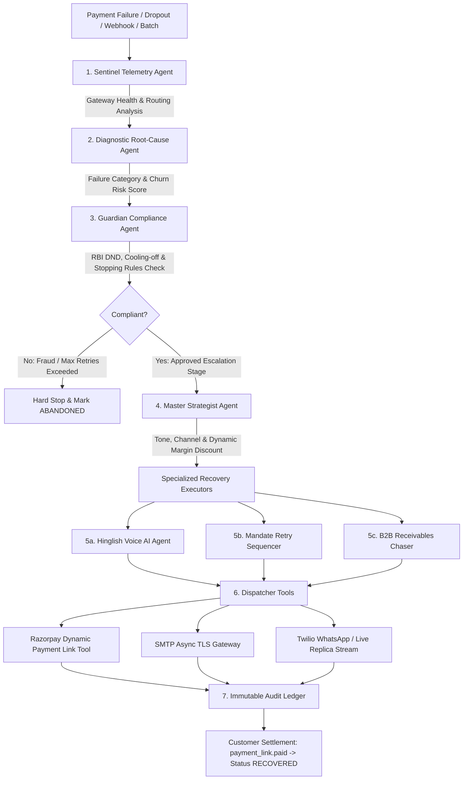

# 🦈 Shark Recovery — Autonomous Multi-Agent AI Revenue Recovery Platform

> **An autonomous, multi-agent AI system that detects revenue loss vectors (checkout dropouts, payment gateway degradation, recurring mandate failures, overdue B2B invoices), diagnoses root causes, optimizes dynamic margin-bounded incentives, and executes compliant multi-channel recovery workflows across WhatsApp, Email, and interactive Hinglish Voice AI.**

[](https://fastapi.tiangolo.com)
[](https://react.dev)
[](https://vitejs.dev)
[](https://tailwindcss.com)
[](https://razorpay.com)
[](LICENSE)

---

## 📌 Why Now? The Core Problem & "The Bar"

Revenue loss in digital commerce and SaaS rarely happens in one clean step:
1. **Payment Degradation**: Bank gateway 503 lag or UPI CBS downtime silently causes payment failures.
2. **Checkout Drop-off**: High-intent shoppers drop out due to daily UPI debit limits, OTP expiration, or price friction.
3. **Recurring Mandate Failures**: Subscription auto-debits reject due to salary cycle misalignment or temporary bank hold.
4. **B2B Receivables**: Enterprise Net-30/60 invoices sit unpaid without proactive negotiation.

Traditional recovery systems rely on static, generic email reminders that erode brand trust and fail to close the loop. 

**Shark Recovery raises the bar:** It does not merely detect failures—it operates as a collaborative swarm of specialized AI agents that autonomously triage root causes, enforce strict regulatory and financial stopping rules (RBI cooling-off windows, DND hours, bounded retry limits), dynamically formulate margin-preserving incentives ($0\%\le d\le 15\%$), synthesize turn-by-turn Hinglish Voice AI calls, and produce a verifiable financial audit trail of **Measured Money Recovered**.

---

## 🏛️ Autonomous Multi-Agent Architecture

Shark Recovery organizes specialized AI agents into a coordinated recovery pipeline:



### Agent Roles & Responsibilities

| Agent | Module | Core Functionality |
| :--- | :--- | :--- |
| **Sentinel Telemetry Agent** | `backend/agents/sentinel_agent.py` | Analyzes live database telemetry and gateway health across HDFC UPI, SBI Netbanking, ICICI, Razorpay Smart Routing, and NPCI e-Mandate. Detects 503 bank outages and recommends routing bypasses. |
| **Diagnostic Root-Cause Agent** | `backend/agents/diagnostic_agent.py` | Employs few-shot LLM reasoning (with heuristic fallback) to classify failures into 7 categories (`INSUFFICIENT_FUNDS`, `AUTHENTICATION_FAILED`, `BANK_SERVER_ERROR`, `EXPIRED_CARD`, `USER_DROPOUT`, `NETWORK_TIMEOUT`, `PAYMENT_DECLINED`) and computes churn/fraud risk ($0.0\text{--}1.0$). |
| **Guardian Compliance Agent** | `backend/agents/compliance_agent.py` | Enforces regulatory guardrails: RBI Do-Not-Disturb (DND) calling window (8:00 AM – 8:00 PM IST), bounded retry ceilings ($\le 2$ attempts), cooling-off intervals (4h–48h), and hard halts on stolen cards/fraud. |
| **Master Strategist Agent** | `backend/agents/strategy_agent.py` | Selects optimal omnichannel combination, persuasive communication tone (`casual_hinglish`, `incentive_focused`, `empathetic`, `professional`), and dynamic margin-bounded discount ($0\%\le d\le 15\%$). |
| **Hinglish Voice Recovery AI** | `backend/agents/voice_agent.py` | Generates 5-turn conversational Hinglish voice scripts for high-value orders ($> ₹5,000$), tags speaker emotions, detects intent (`PROMISE_TO_PAY`), records promised dates, and executes live browser Web Speech Audio Synthesis. |
| **Mandate Retry Sequencer & B2B Chaser** | `backend/agents/mandate_agent.py` | Generates 3-slot cooling-off retry schedules (+24h, +72h, +120h) targeting morning banking hours and salary cycles (1st–5th of month), plus B2B installment negotiation plans. |

---

## ⚡ 6 Core Enterprise Revenue Loss Vectors

Shark Recovery natively handles all 6 revenue loss vectors:

1. **E-Commerce Checkout Dropouts (UPI Limits & Low Funds)**
   - **Trigger**: Customer hits ₹1,00,000 daily UPI debit limit or lacks balance.
   - **Intervention**: Strategist crafts a high-urgency Hinglish WhatsApp message offering a dynamic 10% coupon (`RECOVER10`) with alternative Credit Card / Netbanking payment links.
2. **Bank Gateway 503 Degradation Spikes**
   - **Trigger**: State Bank of India (SBI) or HDFC CBS gateway outage during 3DS redirect.
   - **Intervention**: Sentinel flags node degradation; Strategist sends empathetic zero-margin reassurance link preserving merchant margin.
3. **Recurring Subscription e-Mandate Failures**
   - **Trigger**: Card / UPI AutoPay recurring mandate rejected by issuing bank.
   - **Intervention**: Mandate Sequencer schedules a 3-slot cooling-off retry plan (+24h, +72h, +120h) aligning with liquidity windows and sends fallback payment links.
4. **B2B Invoice Receivables & Promise-to-Pay Tracker**
   - **Trigger**: Enterprise Net-30 invoice overdue by 15+ days.
   - **Intervention**: Formal email restructuring the invoice into a 50% upfront installment with a 3% prompt payment rebate, logging Promise-to-Pay milestones.
5. **High-Value Cart Abandonment (> ₹5,000)**
   - **Trigger**: High-ticket order (e.g. ₹14,999 electronics) abandoned on payment authentication.
   - **Intervention**: Hinglish Voice AI Agent generates a conversational dialogue script, synthesizes speech via Web Audio API, captures customer intent, and dispatches 1-click link via SMS/WhatsApp.
6. **Stolen Card / Fraudulent Payment Halt**
   - **Trigger**: Stolen card or high fraud risk score ($> 0.85$).
   - **Intervention**: Guardian Compliance Agent halts autonomous outreach immediately, logging a security block to protect merchant chargeback liability.

---

## 💻 Tech Stack & Infrastructure

### Backend
* **Runtime & Framework:** Python 3.11+, FastAPI (Async), Uvicorn.
* **Database & ORM:** SQLModel, SQLAlchemy 2.0 (Async engine with `aiosqlite`).
* **LLM Engine & Fallbacks:** LiteLLM / Google Gemini / Groq (`gemini-2.5-flash` / `gpt-oss-120b`) with deterministic rule engine fallback.
* **Integrations:** Razorpay Standard Checkout & Payment Links API, `aiosmtplib` (Gmail TLS/587 SMTP), Twilio WhatsApp API.
* **Dependency Manager:** `uv`.

### Frontend
* **UI Framework:** React 19, TypeScript, Vite 8.
* **Styling & Design System:** TailwindCSS v4, Lucide Icons, Custom Indian Financial notation (₹ INR Lakhs/Crores).
* **Audio & Synthesis:** Web Speech API (`SpeechSynthesisUtterance`) with turn-by-turn dialogue synchronization.
* **Interactive Testing:** Razorpay official `checkout.js` SDK modal for live failure generation.

---

## 🚀 Quickstart & Setup Guide

### 1. Prerequisites
* **Python 3.11+** with `uv` installed (`pip install uv` or `winget install astral-sh.uv`)
* **Node.js 18+** and **npm**

### 2. Clone & Configure Environment
```bash
git clone https://github.com/your-username/AI_Shark_Razorpay.git
cd AI_Shark_Razorpay

# Setup Backend Environment
cd backend
cp .env.example .env
```

Configure the following credentials in `backend/.env`:
```ini
# LLM Providers (Optional - deterministic rule fallbacks included)
GEMINI_API_KEY=your_gemini_api_key
GROQ_API_KEY=your_groq_api_key

# Razorpay Test Credentials
RAZORPAY_KEY_ID=rzp_test_YourKeyId
RAZORPAY_KEY_SECRET=YourKeySecret
RAZORPAY_WEBHOOK_SECRET=YourWebhookSecret

# SMTP Email Dispatch (Gmail App Password)
SMTP_HOST=smtp.gmail.com
SMTP_PORT=587
SMTP_USER=your_email@gmail.com
SMTP_PASSWORD=your_gmail_app_password
SMTP_FROM_EMAIL=Shark Recovery <your_email@gmail.com>

# App Configuration
DEBUG=false
MAX_RETRY_ATTEMPTS=2
MAX_DISCOUNT_PERCENT=15.0
```

### 3. Launch Platform (One-Command Runner)
From the repository root:
```bash
python run_demo.py
```
* **Dashboard Frontend:** [http://localhost:5173](http://localhost:5173)
* **Backend API Swagger:** [http://127.0.0.1:8000/docs](http://127.0.0.1:8000/docs)

---

## 🧪 Automated Test Verification

Run all test suites to verify schemas, agent reasoning, webhooks, and mathematical precision:

```bash
cd backend

# Phase 1: SQLModel Database Schemas & CRUD Verification
uv run python test_schemas.py

# Phase 2: Multi-Agent Swarm, Gating & Orchestrator Logic
uv run python test_agents.py

# Phase 3: Razorpay Webhooks, Simulation Engine & Telemetry APIs
uv run python test_api.py
```

---

## 📊 Complete Feature Matrix

| Feature | Description | File / Component |
| :--- | :--- | :--- |
| **Multi-Vector Benchmark Suite** | One-click execution of 8 diverse payment failure scenarios measuring exact revenue at risk, money recovered, margin preserved, and recovery ROI multiple. | [BatchBenchmarkSuite.tsx](file:///E:/Coding/Projects/AI_Shark_Razorpay/frontend/src/components/BatchBenchmarkSuite.tsx) |
| **Live Razorpay Checkout Modal** | Native integration of official `checkout.js` SDK allowing users to test card failures, OTP aborts, and UPI rejections live. | [RazorpayCheckoutButton.tsx](file:///E:/Coding/Projects/AI_Shark_Razorpay/frontend/src/components/RazorpayCheckoutButton.tsx) |
| **Sentinel Degradation Monitor** | Dynamic node health monitor analyzing bank success rates and latency from live database logs. | [SentinelTelemetryCard.tsx](file:///E:/Coding/Projects/AI_Shark_Razorpay/frontend/src/components/SentinelTelemetryCard.tsx) |
| **Interactive Voice AI Simulator** | Turn-by-turn conversational Hinglish script generator with live browser audio synthesis (`SpeechSynthesisUtterance`). | [VoiceCallModal.tsx](file:///E:/Coding/Projects/AI_Shark_Razorpay/frontend/src/components/VoiceCallModal.tsx) |
| **Omnichannel Email & WhatsApp** | Automated dual delivery: rich HTML recovery email with dynamic discount table + WhatsApp message stream. | [orchestrator.py](file:///E:/Coding/Projects/AI_Shark_Razorpay/backend/agents/orchestrator.py) |
| **Live WhatsApp Replica Widget** | Interactive mobile phone simulator with animated chat bubbles, discount copy, and 1-click payment triggers. | [LiveWhatsAppReplica.tsx](file:///E:/Coding/Projects/AI_Shark_Razorpay/frontend/src/components/LiveWhatsAppReplica.tsx) |
| **Chronological Audit Ledger** | Immutable trace recording every agent step, input/output JSON payloads, and execution duration. | [AuditLogTable.tsx](file:///E:/Coding/Projects/AI_Shark_Razorpay/frontend/src/components/AuditLogTable.tsx) |
| **Autonomous Gating & Stopping Rules** | Compliance engine enforcing bounded retry limits, cooling-off windows, and RBI DND hours. | [compliance_agent.py](file:///E:/Coding/Projects/AI_Shark_Razorpay/backend/agents/compliance_agent.py) |
| **Batch CSV Ingestion** | Upload bulk payment failure CSVs with automatic asynchronous recovery execution per row. | [CsvUploader.tsx](file:///E:/Coding/Projects/AI_Shark_Razorpay/frontend/src/components/CsvUploader.tsx) |
| **Single Failure Manual Injector** | Operator form with clean placeholders to inject custom customer name, phone, amount, and failure reason. | [SingleFailureForm.tsx](file:///E:/Coding/Projects/AI_Shark_Razorpay/frontend/src/components/SingleFailureForm.tsx) |

---

## 📜 License

Distributed under the MIT License. See `LICENSE` for more information.
