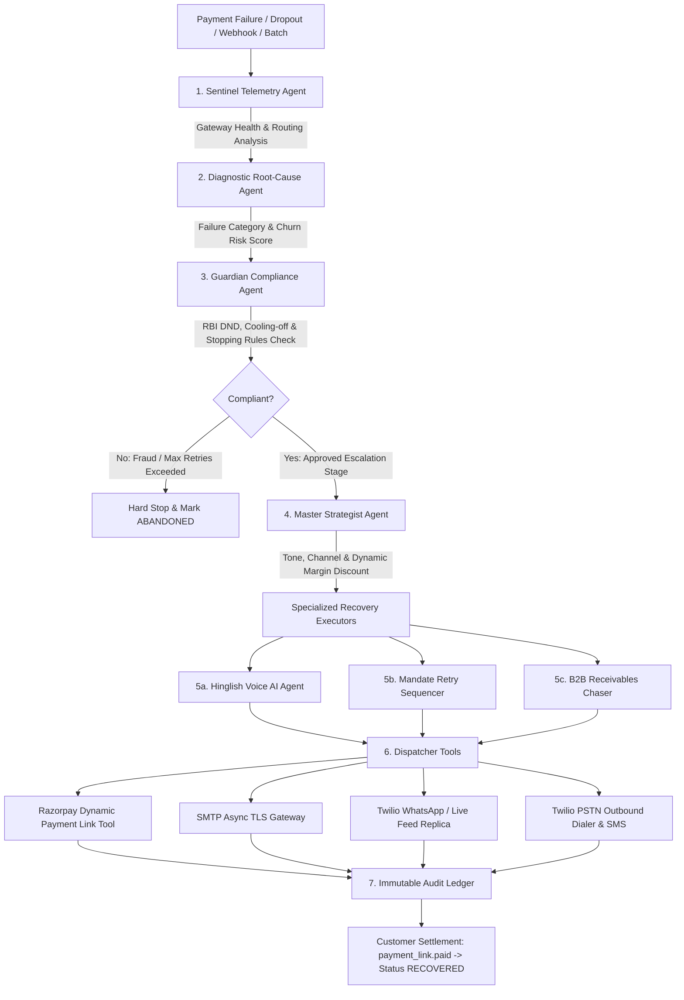

# 🦈 Shark Recovery — Autonomous Multi-Agent AI Revenue Recovery Platform

> **An autonomous, multi-agent AI revenue recovery platform built for Razorpay merchants in India. Shark Recovery intercepts payment failures and checkout dropouts in real time, diagnoses root causes, enforces RBI regulatory guardrails, computes dynamic margin-bounded incentives ($0\%\le d\le 15\%$), and executes compliant omnichannel recovery across WhatsApp, Email, and interactive Hinglish Voice AI (Gemini Live & Twilio PSTN).**

[](https://fastapi.tiangolo.com)
[](https://react.dev)
[](https://vitejs.dev)
[](https://tailwindcss.com)
[](https://razorpay.com)
[](https://ai.google.dev)
[](https://twilio.com)
[](LICENSE)

---

## 📌 Why Now? The Core Problem & "The Bar"

Revenue loss in Indian digital commerce and SaaS occurs across 4 critical vectors:
1. **Payment Infrastructure Degradation**: Bank CBS 503 latency and UPI switch downtime silently abort transactions.
2. **Checkout Drop-off & Intent Friction**: High-intent shoppers drop out due to daily UPI debit limits, OTP timeouts, or friction.
3. **Recurring Mandate Rejections**: Subscription auto-debits fail due to salary cycle misalignment or temporary card holds.
4. **Uncollected B2B Receivables**: Enterprise Net-30/60 invoices sit unpaid without proactive negotiation.

Traditional dunning tools send static, generic emails that damage brand trust and fail to close the loop.

**Shark Recovery raises the bar:** It operates as a collaborative swarm of specialized AI agents that autonomously triage root causes, enforce regulatory stopping rules (RBI DND calling windows, bounded retry limits, cooling-off intervals), dynamically formulate margin-preserving incentives ($0\%, 5\%, 10\%, 15\%$), conduct real-time Hinglish Voice AI calls, and maintain an immutable financial ledger of **Measured Money Recovered**.

---

## 🏛️ Autonomous Multi-Agent Architecture



### Agent Roles & Responsibilities

| Agent | Module | Core Functionality |
| :--- | :--- | :--- |
| **Sentinel Telemetry Agent** | `backend/agents/sentinel_agent.py` | Analyzes live database telemetry and gateway health across HDFC UPI, SBI Netbanking, ICICI, Razorpay Smart Routing, and NPCI e-Mandate. Detects 503 bank outages and recommends routing bypasses. |
| **Diagnostic Root-Cause Agent** | `backend/agents/diagnostic_agent.py` | Employs few-shot LLM reasoning (with deterministic fallback) to classify failures into 7 categories (`INSUFFICIENT_FUNDS`, `AUTHENTICATION_FAILED`, `BANK_SERVER_ERROR`, `EXPIRED_CARD`, `USER_DROPOUT`, `NETWORK_TIMEOUT`, `PAYMENT_DECLINED`) and computes churn/fraud risk ($0.0\text{--}1.0$). |
| **Guardian Compliance Agent** | `backend/agents/compliance_agent.py` | Enforces regulatory guardrails: RBI Do-Not-Disturb (DND) calling window (8:00 AM – 8:00 PM IST), bounded retry ceilings ($\le 2$ attempts), cooling-off intervals (4h–48h), and hard halts on stolen cards/fraud. |
| **Master Strategist Agent** | `backend/agents/strategy_agent.py` | Selects optimal omnichannel combination, persuasive communication tone (`casual_hinglish`, `incentive_focused`, `empathetic`, `professional`), and dynamic margin-bounded discount tier ($0\%, 5\%, 10\%, 15\%$). |
| **Hinglish Voice Recovery AI** | `backend/agents/voice_agent.py`<br>`backend/routers/voice_stream.py` | Multi-mode conversational voice engine: 5-turn Hinglish dialogue scripts with emotion tagging, Kokoro neural / Web Speech audio synthesis, Gemini 2.0 Live WebSocket streaming, and Twilio PSTN outbound dialer. |
| **Mandate Retry Sequencer & B2B Chaser** | `backend/agents/mandate_agent.py` | Generates 3-slot cooling-off retry schedules (+24h, +72h, +120h) targeting morning banking hours and salary cycles (1st–5th of month), plus B2B installment negotiation plans. |

---

## ⚡ 6 Core Enterprise Revenue Loss Vectors

Shark Recovery natively handles all 6 revenue loss vectors:

1. **E-Commerce Checkout Dropouts (UPI Limits & Low Funds)**
   - **Trigger**: Customer hits ₹1,00,000 daily UPI debit limit or lacks savings balance.
   - **Intervention**: Strategist crafts high-urgency Hinglish WhatsApp message offering a dynamic 10% coupon (`RECOVER10`) with alternative Credit Card / Netbanking payment link.
2. **Bank Gateway 503 Degradation Spikes**
   - **Trigger**: State Bank of India (SBI) or HDFC CBS gateway outage during 3DS redirect.
   - **Intervention**: Sentinel flags node degradation; Strategist sends empathetic zero-margin reassurance link preserving merchant margin (0% discount).
3. **Recurring Subscription e-Mandate Failures**
   - **Trigger**: Card / UPI AutoPay recurring mandate rejected by issuing bank.
   - **Intervention**: Mandate Sequencer schedules a 3-slot cooling-off retry plan (+24h, +72h, +120h) aligning with liquidity windows and sends fallback payment links.
4. **B2B Invoice Receivables & Promise-to-Pay Tracker**
   - **Trigger**: Enterprise Net-30 invoice overdue by 15+ days.
   - **Intervention**: Formal email restructuring the invoice into a 50% upfront installment with a 3% prompt payment rebate, logging Promise-to-Pay milestones.
5. **High-Value Cart Abandonment (> ₹5,000)**
   - **Trigger**: High-ticket order (e.g. ₹14,999 electronics) abandoned during payment authentication.
   - **Intervention**: Hinglish Voice AI conducts a conversational dialogue, captures customer intent (`PROMISE_TO_PAY`), records date, and dispatches 1-click link via SMS/WhatsApp.
6. **Stolen Card / Fraudulent Payment Halt**
   - **Trigger**: Stolen card or high fraud risk score ($> 0.85$).
   - **Intervention**: Guardian Compliance Agent halts autonomous outreach immediately, logging a security block to protect merchant chargeback liability.

---

## 🎙️ Interactive Hinglish Voice Recovery AI

The Voice Recovery subsystem ([`VoiceCallModal.tsx`](file:///E:/Coding/Projects/AI_Shark_Razorpay/frontend/src/components/VoiceCallModal.tsx) & [`voice_stream.py`](file:///E:/Coding/Projects/AI_Shark_Razorpay/backend/routers/voice_stream.py)) provides 3 complementary modes adapted for desktop and mobile viewports ($\le 375\text{px}$):

1. **Recorded Transcript & Neural Playback**:
   - Turn-by-turn dialogue inspection with speaker emotion tags (`empathetic`, `reassuring`, `helpful`).
   - Browser Web Speech API & Kokoro-82M neural TTS fallback with phonetic Hinglish normalization.
   - Live Devanagari script transliteration toggle (`नमस्ते जी, मैं शार्क पेमेंट टीम...`).
   - Automatic extraction of Promise-To-Pay (PTP) target date and outcome status.
2. **Live Mic Stream (Gemini 2.0 Live WebSockets)**:
   - Full-duplex browser microphone capture streaming raw PCM audio to `/api/voice/stream`.
   - Real-time Hinglish AI response with live audio visualizer and instant dynamic payment link generation.
3. **PSTN Outbound Dialer (Twilio Telephony)**:
   - Dispatches real-world cellular calls to Indian phone numbers with dynamic TwiML generation.
   - Live call state monitoring (`ringing`, `in-progress`, `completed`).
   - Automated 1-click Razorpay payment link dispatch via SMS upon call completion.

---

## 🖥️ FinOps Experience & Usability Standards

Evaluated and hardened under the **Impeccable Design System** (38/40 Usability Score, 0 detector warnings):

* **Alex (Power User / FinOps Lead)**:
  - Multi-select row checkboxes with bulk triage bar (`Retry Selected`).
  - Single-click CSV ledger export (`shark_recovery_ledger_YYYY-MM-DD.csv`).
  - Full keyboard navigation: `j` / `k` (row traverse), `x` (toggle row selection), `r` (retry), `/` (search focus), `esc` (clear).
* **Sam (Accessibility)**:
  - Full ARIA grid semantics (`aria-activedescendant`, `role="row"`, `aria-selected`).
  - Live polite screen reader announcements on keyboard navigation (`aria-live="polite"`).
* **Jordan (First-Timer / Junior Merchant)**:
  - Plain-language banking acronym glossary tooltips (`UPI`, `3DS`, `CBS`, `PTP`, `NPCI`, `HMAC`).
* **Mobile Viewport Optimization**:
  - Adaptive stacked card view on mobile screens ($< 640\text{px}$).
  - Fully responsive modal padding, title scaling, and compact tab labels on small viewports ($\le 375\text{px}$).
* **Categorized Settings & Guardrail Safety**:
  - Tabbed categories in [`SettingsView.tsx`](file:///E:/Coding/Projects/AI_Shark_Razorpay/frontend/src/views/SettingsView.tsx) (Credentials, Recovery Guardrails, DND, AI Prompts, System Maintenance).
  - Two-step confirmation Destructive Purge Modal barrier for database resets.
  - Live credential health ping tests for Razorpay, Twilio, Gemini, Groq, and SMTP.

---

## 💻 Tech Stack & Infrastructure

### Backend
* **Runtime & Framework:** Python 3.11+, FastAPI (Async), Uvicorn.
* **Database & ORM:** SQLModel, SQLAlchemy 2.0 (Async engine with `aiosqlite`).
* **LLM & Voice Engines:** Google Gemini (`gemini-2.0-flash`, Gemini Live WebSockets), Groq (`llama-3.3-70b`), Kokoro-82M neural TTS, with deterministic rule engine fallback.
* **Integrations:** Razorpay API (Orders, Payments, Payment Links), Twilio (Voice PSTN & WhatsApp Sandbox), `aiosmtplib` (Gmail TLS/587).
* **Package Management:** `uv`.

### Frontend
* **UI Framework:** React 19, TypeScript, Vite 8.
* **Styling & Design System:** TailwindCSS v4, Lucide Icons, Custom Indian Financial notation (₹ INR Lakhs/Crores).
* **Audio & Synthesis:** Web Audio API, MediaRecorder, Web Speech API (`SpeechSynthesisUtterance`).
* **Testing & Simulation:** Official Razorpay `checkout.js` SDK modal for live failure generation.

---

## 🚀 Quickstart & Setup Guide

### 1. Prerequisites
* **Python 3.11+** with `uv` installed (`pip install uv` or `winget install astral-sh.uv`)
* **Node.js 18+** and **npm**

### 2. Clone & Configure Environment
```bash
git clone https://github.com/your-username/AI_Shark_Razorpay.git
cd AI_Shark_Razorpay

# Setup Environment in repository root
cp .env.example .env
```

Configure credentials in `.env`:
```ini
# LLM & Voice Providers (Optional - deterministic rule fallbacks included)
GEMINI_API_KEY=your_gemini_api_key
GROQ_API_KEY=your_groq_api_key

# Razorpay Test Credentials
RAZORPAY_KEY_ID=rzp_test_YourKeyId
RAZORPAY_KEY_SECRET=YourKeySecret
RAZORPAY_WEBHOOK_SECRET=YourWebhookSecret

# Twilio Telephony & WhatsApp (Optional)
TWILIO_ACCOUNT_SID=your_twilio_sid
TWILIO_AUTH_TOKEN=your_twilio_token
TWILIO_PHONE_NUMBER=your_twilio_phone
TWILIO_WHATSAPP_NUMBER=your_twilio_whatsapp

# SMTP Email Dispatch (Gmail App Password)
SMTP_HOST=smtp.gmail.com
SMTP_PORT=587
SMTP_USER=your_email@gmail.com
SMTP_PASSWORD=your_gmail_app_password
SMTP_FROM_EMAIL=Shark Recovery <your_email@gmail.com>

# App Configuration
DEBUG=false
MAX_RETRY_ATTEMPTS=2
MAX_DISCOUNT_PERCENT=15.0
```

### 3. Launch Platform

#### Option A: One-Command Local Runner
From the repository root:
```bash
python run_demo.py
```
* **Dashboard Frontend:** [http://localhost:5173](http://localhost:5173)
* **Backend API Swagger:** [http://127.0.0.1:8000/docs](http://127.0.0.1:8000/docs)

#### Option B: Docker Compose (Production Multi-Container)
```bash
docker compose up --build
```
* **Dashboard Frontend (Nginx SPA):** [http://localhost:3000](http://localhost:3000)
* **Backend API Swagger:** [http://127.0.0.1:8000/docs](http://127.0.0.1:8000/docs)
* **Persistent SQLite Volume:** `recovery_data` mounted at `/app/data/recovery.db`

---

## 🧪 Automated Test Verification

Run all test suites to verify schemas, agent reasoning, webhooks, and mathematical precision:

```bash
cd backend

# Phase 1: SQLModel Database Schemas & CRUD Verification
uv run python test_schemas.py

# Phase 2: Multi-Agent Swarm, Gating & Orchestrator Logic
uv run python test_agents.py

# Phase 3: Razorpay Webhooks, Simulation Engine & Telemetry APIs
uv run python test_api.py
```

---

## 📊 Complete Feature Matrix

| Feature | Description | Primary Component |
| :--- | :--- | :--- |
| **Autonomous Recovery Hub** | Comprehensive transaction ledger with batch selection, CSV export, keyboard shortcuts, and acronym tooltips. | [TransactionTable.tsx](file:///E:/Coding/Projects/AI_Shark_Razorpay/frontend/src/components/TransactionTable.tsx) |
| **Multi-Vector Benchmark Suite** | 8-scenario benchmark measuring exact revenue at risk, money recovered, margin preserved, and recovery ROI multiple. | [BatchBenchmarkSuite.tsx](file:///E:/Coding/Projects/AI_Shark_Razorpay/frontend/src/components/BatchBenchmarkSuite.tsx) |
| **Hinglish Voice Recovery AI** | 3-mode modal: recorded Hinglish transcript with Devanagari transliteration, Gemini Live mic stream, and Twilio PSTN dialer. | [VoiceCallModal.tsx](file:///E:/Coding/Projects/AI_Shark_Razorpay/frontend/src/components/VoiceCallModal.tsx) |
| **Live WhatsApp Feed & Simulator** | Interactive mobile chat stream with animated message bubbles, dynamic coupon badges, and 1-click Razorpay payment triggers. | [WhatsAppFeedView.tsx](file:///E:/Coding/Projects/AI_Shark_Razorpay/frontend/src/views/WhatsAppFeedView.tsx) |
| **Chronological Audit Ledger** | Real-time timeline recording every agent step, input/output JSON payloads, and execution duration. | [AuditLogTimeline.tsx](file:///E:/Coding/Projects/AI_Shark_Razorpay/frontend/src/components/AuditLogTimeline.tsx) |
| **Live Razorpay Checkout Modal** | Official `checkout.js` SDK modal enabling interactive generation of real payment failures (card, OTP, UPI). | [RazorpayCheckoutButton.tsx](file:///E:/Coding/Projects/AI_Shark_Razorpay/frontend/src/components/RazorpayCheckoutButton.tsx) |
| **Sentinel Degradation Monitor** | Live telemetry tracking success rates and latency across HDFC, SBI, ICICI, and NPCI e-Mandate. | [SentinelTelemetryCard.tsx](file:///E:/Coding/Projects/AI_Shark_Razorpay/frontend/src/components/SentinelTelemetryCard.tsx) |
| **Categorized Settings & Guardrails** | Tabbed configuration for API keys, recovery thresholds, RBI DND window, and destructive DB purge barrier. | [SettingsView.tsx](file:///E:/Coding/Projects/AI_Shark_Razorpay/frontend/src/views/SettingsView.tsx) |
| **Batch CSV Ingestion & Single Injector** | Bulk failure CSV uploader and operator form to test custom dropouts on demand. | [IngestionView.tsx](file:///E:/Coding/Projects/AI_Shark_Razorpay/frontend/src/views/IngestionView.tsx) |

---

## 📜 License

Distributed under the MIT License. See `LICENSE` for more information.
